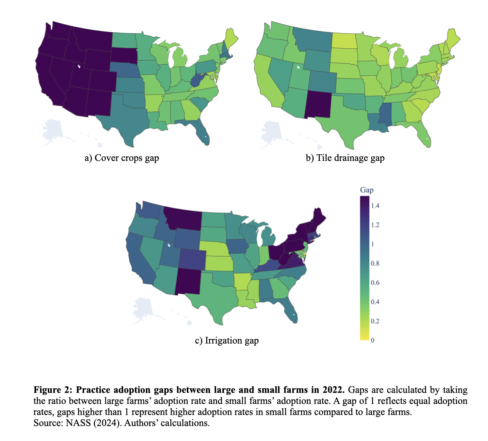

# Elizabeth Espinosa-Uquillas

<figure>
  
  <figcaption> </figcaption>
</figure>

## About

I'm a Ph.D. Candidate in Complex Systems and Data Science at the University of Vermont (UVM), and a Graduate Research Fellow at the Food Systems Research Institute at UVM. I hold a B.A. in Economics from the Pontifical Catholic University of Ecuador and an M.A. in Development Economics from the Facultad Latinoamericana de Ciencias Sociales (FLACSO) in Ecuador. 

In my doctoral research, I study farmers' climate change resilience behaviors in the U.S., particularly the influence of government programs and climate risks on farmers' climate adaptation responses, in the form of nature-based practices, such as cover crops and crop rotations, and technology implementation, including irrigation and tile drainage systems. My research combines large-scale, time-series, and high-resolution data and applies Bayesian statistical models.

📧 eespinos@uvm.edu \
:mortar_board: [google scholar](https://scholar.google.com/citations?hl=en&user=vdXBDXYAAAAJ&view_op=list_works&sortby=pubdate) \
:heavy_check_mark: [github](https://github.com/ElizabethEspinosa) \
:bust_in_silhouette: [linkedin](https://www.linkedin.com/in/elizabeth-espinosa-uquillas-787b3385/)

 
 
 
 
 
 
 
 

# Under Peer-review
 
 

<figure>
  
  <figcaption> </figcaption>
</figure>

### Climate Change Adaptation through the lens of Farm Size

*Abstract: The heterogeneity of different farmland sizes has been overlooked in the climate adaptation literature, yet it is crucial for identifying effective policy interventions to achieve national-scale climate resilience. Using U.S. Agricultural Census data from 2012, 2017, and 2022 aggregated by farm size groupings within states, we compare the temporal changes in adoption of three water-related climate adaptation practices (cover crops, tile drainage, and irrigation) across small, medium and large farms, individually. Specifically, we provide estimates of the role of multiple government programs and climate changes in shaping heterogeneous climate adaptation behaviors across farm sizes. Applying multilevel models within a Bayesian framework, we show that temporal changes of government programs and climate conditions correlate with temporal changes in adoption differently across farm sizes...* 

 
 

### Cover Crop Adoption and Disadoption

*Abstract: T...* 
